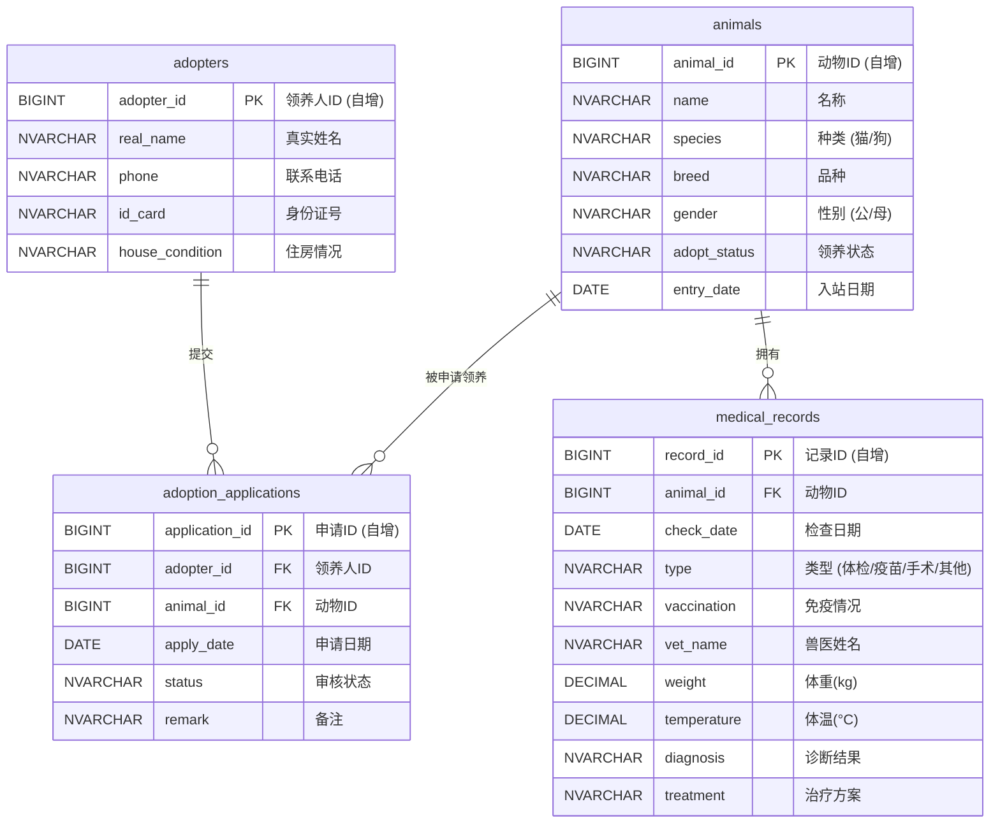

# 城市流浪动物救助站 — 数据库 ER 图

```mermaid
erDiagram
    animals ||--o{ adoption_applications : "被申请领养"
    animals ||--o{ medical_records : "拥有"
    adopters ||--o{ adoption_applications : "提交"

    animals {
        BIGINT animal_id PK "动物ID (自增)"
        NVARCHAR name "名称"
        NVARCHAR species "种类 (猫/狗)"
        NVARCHAR breed "品种"
        NVARCHAR gender "性别 (公/母)"
        NVARCHAR adopt_status "领养状态"
        DATE entry_date "入站日期"
    }

    adopters {
        BIGINT adopter_id PK "领养人ID (自增)"
        NVARCHAR real_name "真实姓名"
        NVARCHAR phone "联系电话"
        NVARCHAR id_card "身份证号"
        NVARCHAR house_condition "住房情况"
    }

    adoption_applications {
        BIGINT application_id PK "申请ID (自增)"
        BIGINT adopter_id FK "领养人ID"
        BIGINT animal_id FK "动物ID"
        DATE apply_date "申请日期"
        NVARCHAR status "审核状态"
        NVARCHAR remark "备注"
    }

    medical_records {
        BIGINT record_id PK "记录ID (自增)"
        BIGINT animal_id FK "动物ID"
        DATE check_date "检查日期"
        NVARCHAR type "类型 (体检/疫苗/手术/其他)"
        NVARCHAR vaccination "免疫情况"
        NVARCHAR vet_name "兽医姓名"
        DECIMAL weight "体重(kg)"
        DECIMAL temperature "体温(°C)"
        NVARCHAR diagnosis "诊断结果"
        NVARCHAR treatment "治疗方案"
    }
```
